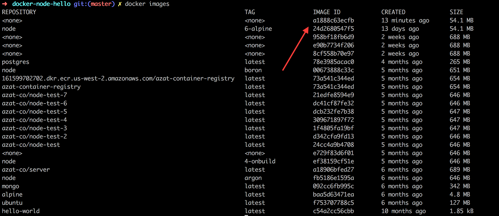
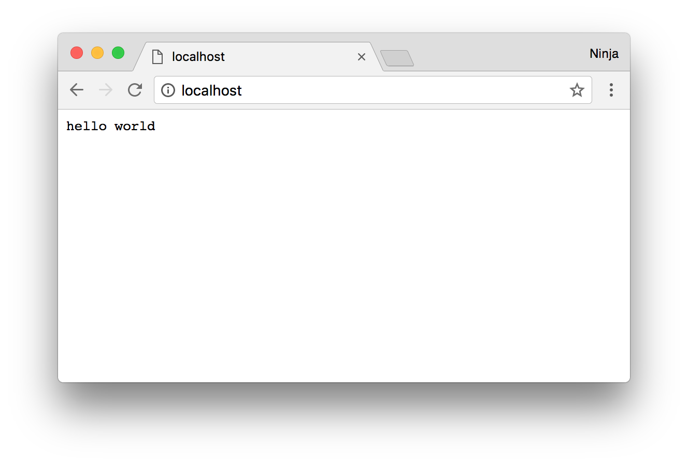

footer: © NodeProgram.com, Node.University and Azat Mardan 2017
slidenumbers: true
theme: Merriweather, 8
build-lists: true

# Node in Production
## Section 3: Node and Docker Containers


Azat Mardan @azat_co


---

# Module 3: Docker Containers

---

## Containers vs. VMs

---

## How VMs work


Source: docker.com

---

## How containers work


Source: docker.com

---

Here are some of the benefits of Docker containers:

* Allow for rapid application development/deployment
* Allow consistent behavior from dev to production, i.e., portable across machines & environments - fewer bugs!
* Extendable (reuse, collaboration + community)
* Lightweight and fast (no guest OS)
* Easy to collaborate, use and maintain
* Can be versioned and components can be reused

---

## Container Terminology

---

# Docker Images

Images – The blueprints of our application which form the basis of containers. We will use the docker pull command to download the specified image.

---

# Docker Containers

Containers – Created from Docker images and run the actual application. We create a container using docker run. A list of running containers can be seen using the docker ps command.

---

# Docker Daemon

Docker Daemon – The background service running on the host that manages building, running and distributing Docker containers. The daemon is the process that runs in the operation system to which clients talk to. It is what makes Docker Engine work.

---

# Docker Client

Docker Client – The command line tool that allows the user to interact with the daemon. There can be other forms of clients – such as Kitematic which provides a GUI.

---

# Docker Hub

Docker Hub – A registry of Docker images. You can think of the registry as a directory of all available Docker images. If required, one can host their own Docker registries and can use them for pulling images.

---

# Dockerfile

Dockerfile – A recipe from which you can create an image. Dockerfile has the base image, instructions to add or copy files, commands to execute, ports to expose and other information. Dockerfile is case sensitive.

---

# Docker Compose

Docker Compose – A mechanism to orchestrate multiple containers needed for a service(s) from a single configuration file docker-compose.yml.

---

# Host

Host – Your computer which hosts docker daemon or a remote machine which hosts docker deamon/engine.

---

## Base Images

---

## Plain OS Base Images:

* [alpine](https://hub.docker.com/_/alpine/)
* [ubuntu](https://hub.docker.com/_/ubuntu/)
* [debian](https://hub.docker.com/_/debian/) and jessie (debian v8)
* [centos](https://hub.docker.com/_/centos/)
* [amazonlinux](https://hub.docker.com/_/amazonlinux)

---

## Environment-Ready Base Images

* [node](https://hub.docker.com/_/node/) v7.9 is based on buildpack-deps:jessie
* node:alpine v6 is based on alpine
* [nginx](https://hub.docker.com/_/nginx/) v1.13 is based on debian:stretch-slim
* Apache [httpd](https://hub.docker.com/_/httpd) v2.2 is based on debian:jessie
* [mongo](https://hub.docker.com/_/mongo/) v3 is based on debian:wheezy-slim
* [postgres](https://hub.docker.com/_/postgres/) v9 is based on debian:jessie

---


## Dockerfile

Blueprint for the images which turn into containers

---


# Main statements

* FROM
* RUN
* WORKDIR
* COPY
* EXPOSE
* CMD

---

## Dockerfile Hello World example

```
/docker-node-hello
  Dockerfile
  server.js  
```


---

server.js:

```
const port = 3000
require('http')
  .createServer((req, res) => {
    console.log('url:', req.url)
    res.end('hello world')
  })
  .listen(port, (error)=>{
    console.log(`server is running on ${port}`)
  })
```

---

Dockerfile:

```
FROM node:6-alpine
RUN mkdir -p /usr/src/app
WORKDIR /usr/src/app
COPY server.js /usr/src/app
EXPOSE 3000
CMD [ "node", "server.js" ]
```


---


Build:

```
docker build .
```

---
```
docker build .
Sending build context to Docker daemon 3.072 kB
Step 1/6 : FROM node:6-alpine
6-alpine: Pulling from library/node
709515475419: Pull complete
cb714116d354: Pull complete
25b12811305e: Pull complete
Digest: sha256:823cf041070ca762608a3a5b4c8ee620df093b2e86c6def04d40d0e5acfe3467
Status: Downloaded newer image for node:6-alpine
 ---> 24d2680547f5
Step 2/6 : RUN mkdir -p /usr/src/app
 ---> Running in 8b52d4f59a57
 ---> 20f588f821c8
Removing intermediate container 8b52d4f59a57
Step 3/6 : WORKDIR /usr/src/app
 ---> 33998dd83654
Removing intermediate container cbf35b20a2a2
Step 4/6 : COPY server.js /usr/src/app
 ---> bc832e3172dd
Removing intermediate container 0529df33ca82
Step 5/6 : EXPOSE 3000
 ---> Running in e32c6f35d1b1
 ---> ead36d9c8800
Removing intermediate container e32c6f35d1b1
Step 6/6 : CMD node server.js
 ---> Running in a4b3a0eeeaef
 ---> a1888c63ecfb
Removing intermediate container a4b3a0eeeaef
Successfully built a1888c63ecfb
```

---

Verify and copy newly built image ID:

```
docker images
```

                  

---

Run with mapping ports host:container:

```
docker run -p 80:3000 {image-id}
```

For example:

```
docker run -p 80:3000 a1888c63ecfb
```

Output (from container):

```
server is running on 3000
```

---

Verify "Hello world" in new terminal session.

```
curl http://localhost
```

or in the browser: <http://localhost>




Remember port 80 is the default port value for HTTP so no need to type it in the URL.

---

Also, verify with Docker Engine:

```
docker ps
```

Output example:

```
CONTAINER ID        IMAGE               COMMAND             CREATED             STATUS              PORTS                  NAMES
9e8fad455bff        a1888c63ecfb        "node server.js"    2 minutes ago       Up 2 minutes        0.0.0.0:80->3000/tcp   quizzical_ardinghelli
```

---


Stop:

```
docker stop {image-id}
```

For example:

```
docker stop 19b4df5a399c
```

---

## Congrats, you've run your first Node web server in a container.

---


## ❔ How do you install dependencies and connect to a database? ❔


---

## Dockerfile Statements

* ENV
* LABEL
* ENTRYPOINT (must have CMD or ENTRYPOINT)
* VOLUME
* ARG
* USER

---

## COPY vs ADD

ADD can fetch from URLs and unzip[^1]

[^1]: Docker/moby source code [link](https://github.com/moby/moby/blob/670c8696a29825b23208496bd4d8e88b5faa7773/builder/dispatchers.go#L77)

---

## Create a new project folder

```
mkdir banking-api
cd banking-api
touch Dockerfile
```

---

## Compose Dockerfile

Must be exactly `Dockerfile`- no extension and starts with capitol letter D

Write in banking-api/Dockerfile base image node v6 from Alpine:

```
FROM node:6-alpine
```

---

## Create app directory

```
RUN mkdir -p /usr/src/app
WORKDIR /usr/src/app
```

---

# Install app dependencies

```
COPY package.json /usr/src/app/
RUN npm install
```

---

# Bundle app source

```
COPY . /usr/src/app
```

---

# Open port and start server

```
EXPOSE 3000
CMD [ "npm", "start" ]
```

---

```
npm i express -SE
```

---

## Creating an Image

---


## Installing and Running Docker

---


## Volumes

---


# Lab 1: Power to AWS CLI

Task: Install AWS CLI, configure, create an instance with apache httpd via AWS CLI and no SSH, make the HTML page (hello world) visible in the browser *publicly*

Detailed instructions and link are in labs/0-installs.md


Time to finish: 15 min 👾
