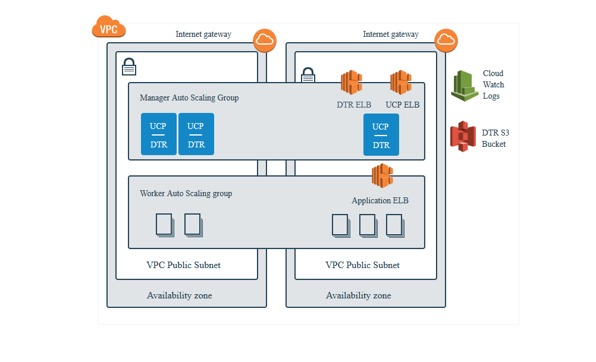
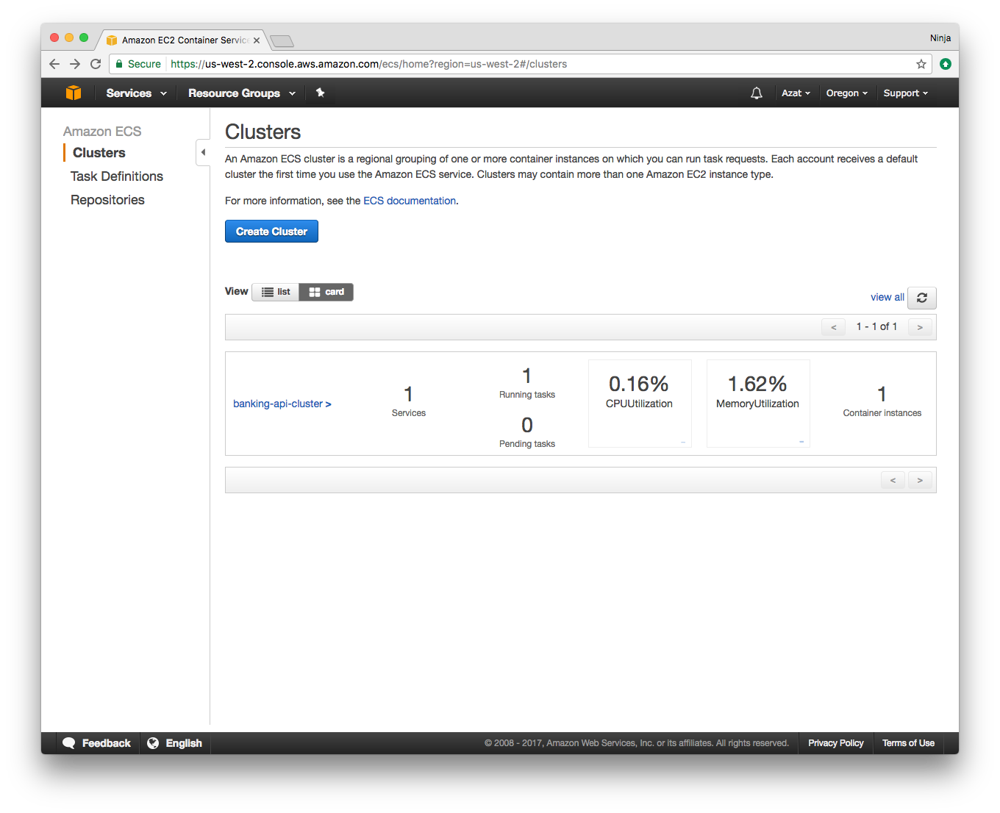
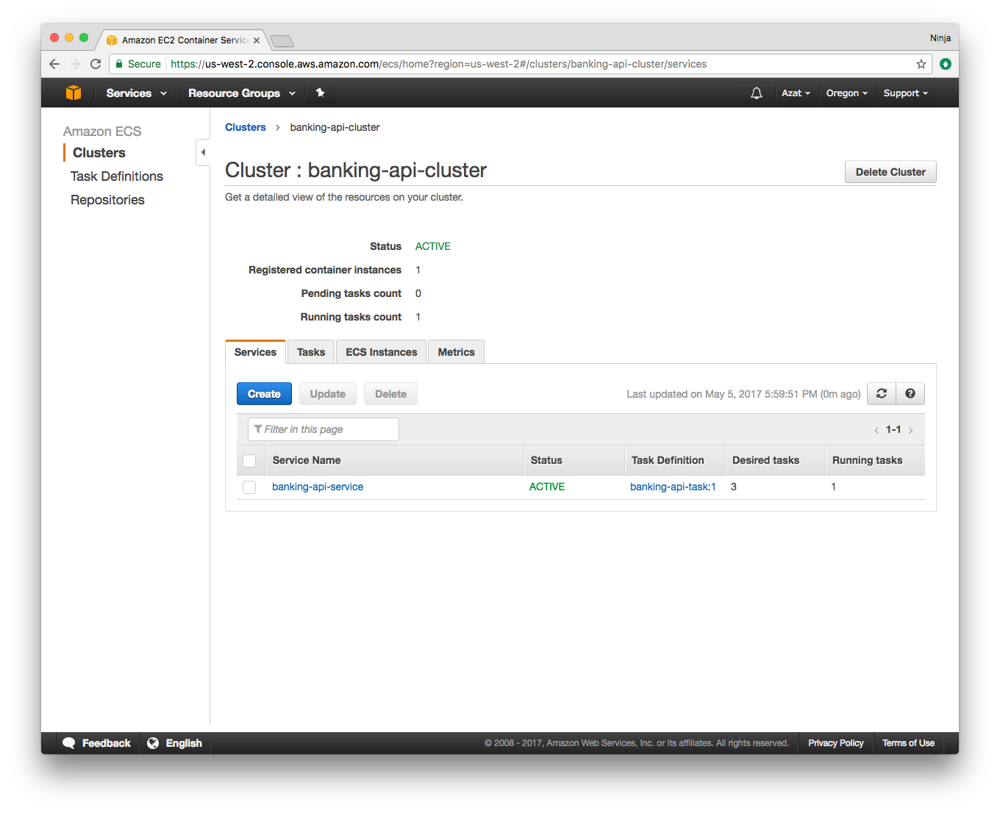
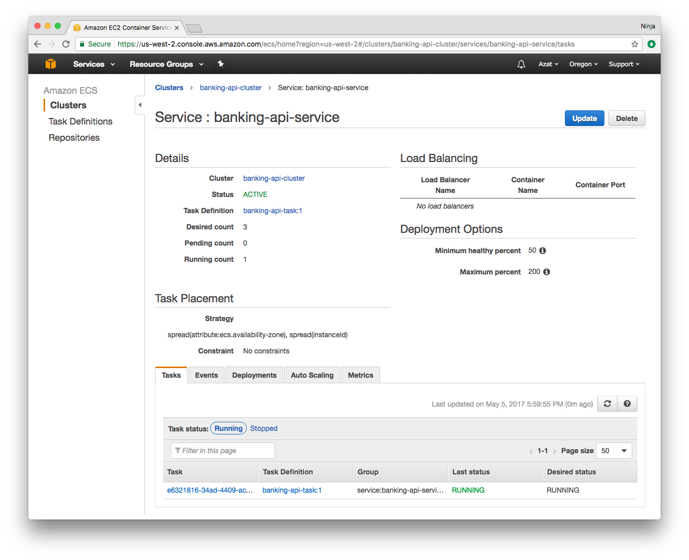
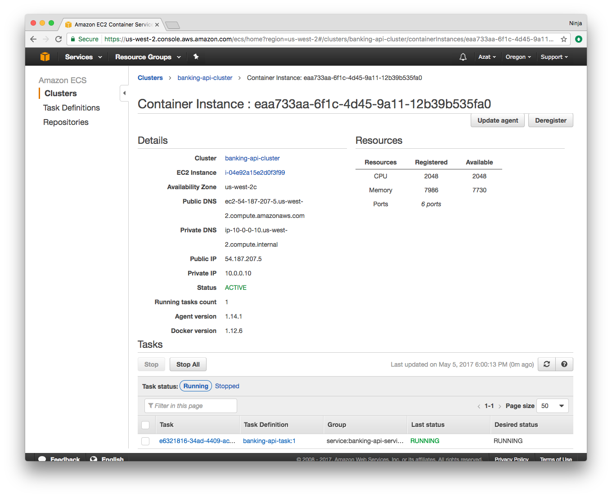

footer: © NodeProgram.com, Node.University and Azat Mardan 2017
slidenumbers: true
theme: Simple, 1
build-lists: true

# Node in Production
## Section 4: Node, Containers and Amazon Web Services

Azat Mardan @azat_co

---

# Types of Cloud Computing

* IaaS
* PaaS
* BaaS
* FaaS
* SaaS

---

# Benefits of cloud

[.autoscale: true]

* Elastic, scalable, flexible and operational agile
* Disaster recovery
* Automatic software updates
* Capital-expenditure Free
* Increased collaboration
* Work from anywhere
* Standard and expertise
* Reduced time to market and competitiveness
* Environmentally friendly
* Easy to use
* Benefits of mass economy of scale
* Global delivery faster

---

# Major Cloud Providers

* Azure
* Google
* AWS

---

# AWS has many Services

---

# AWS Benefits

* One of the first
* Massive scale
* Innovator with news features and services
* Lots of tools - good dev experience
* Almost a standard with lots of expertise, best practices, experts, books, etc.

---

# AWS Services for Containers

* Elastic Compute Cloud (EC2)
* Elastic Container Service (ECS)
* Elastic Container Registry (ECR)
* Elastic Beanstalk Containers - PaaS
* Docker EE for AWS
* Relational Database Service (RDS)

---

## EC2

Do It Yourself approach

* Amazon Linux or other AMI + Docker Engine
* Docker image (AMI)

* CloudFormation, AWS CLI or web console
* User Data to install Docker Engine

---

## ECS

Managed container service

* Monitors containers
* Allows ELB
* Allows autoscaling
* Allows health checks

---

## ECR

Storage for container images which can be used with EC2, ECS or other services

---

## Elastic BeanStack

PaaS

Ideal for small services with few containers.

---

## Docker EE

Comprehensive CloudFormation blueprint

<https://aws.amazon.com/marketplace/pp/B06XCFDF9K>

---

# RDS

Can be used with other services. Allows for managed databases.

---

## Let's cover ECS + ECR usage

---

## AWS EC2 Container Services

* Tasks
* Clusters
* Registries

---

## Registry

Where developers store their images. Allows for versioning and tagging.

---

## Task

Task definition has info about images, env vars and network.

---

## Cluster

Container cluster is like an EC2 instance where containers run.

---

## Service

Container service makes sure your containers from task are running in a cluster. ELB and autoscaling group can be added to a service.

---

[.hide-footer]

---

[.hide-footer]

---

[.hide-footer]

---

[.hide-footer]

---

# AWS is vast

You should have Elastic Load Balancer, multi-availability zone deployment, Continuos Delivery S3, and managed database services.

Learn more about AWS by taking [AWS Intro](node.university/p/aws-intro) and [AWS Intermediate](node.university/p/aws-intermediate)

---

# Demo 💻

Deployment using ECR and EC2 ECS.

---

# Lab 2: AWS Containers

Task: Deploy two containers (API and DB) which connect using ECR and EC2 ECS.

Detailed instructions and link are in labs/2-installs.md

Time to finish: 15 min ☁️

---

# End of the course 🔚
